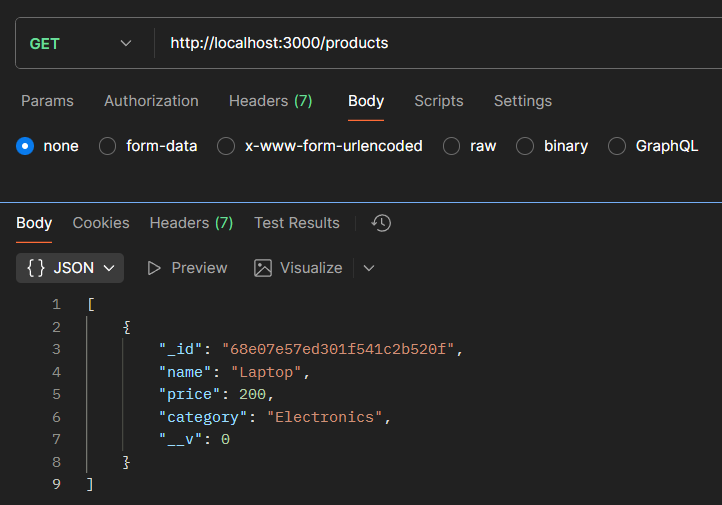
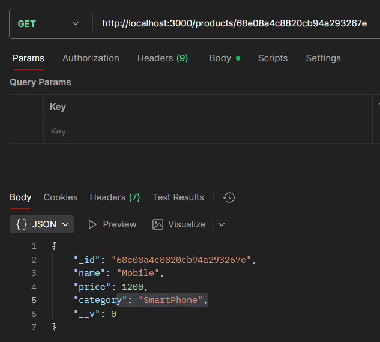
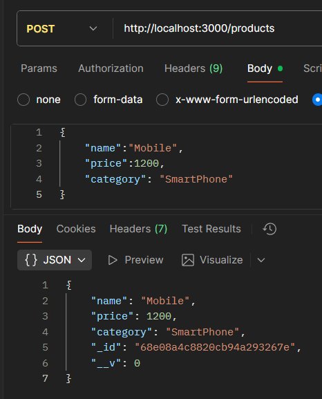
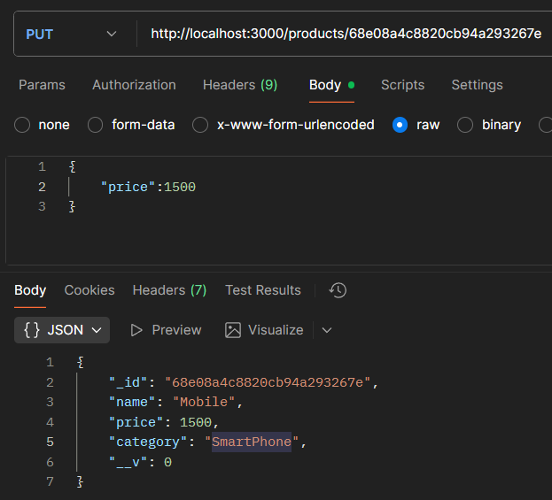
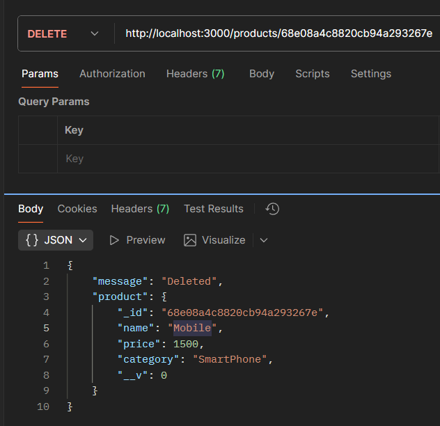

# Product CRUD API with Node.js & Mongoose

## Project Overview
This project is a simple RESTful API built with **Node.js**, **Express**, and **MongoDB (Mongoose)** that allows you to perform **CRUD operations** on a Product database.

- **Create** a new product  
- **Read** all products or a single product  
- **Update** a product  
- **Delete** a product  


## Folder Structure
```
CRUD_Operations/
├── index.js
├── models/
│ └── Product.js
```

## Installation

### 1. Install dependencies:
``` cmd
npm install express mongoose
```

### 2. Make sure MongoDB is installed and running locally, or use a MongoDB Atlas URI.
### 3. Start the server (Server will run at: http://localhost:3000)
```
node index.js
```

## API Endpoints

| Method | Endpoint         | Description               |
|--------|-----------------|----------------------------|
| GET    | /products       | Get all products           |
| GET    | /products/:id   | Get a single product by ID |
| POST   | /products       | Add a new product          |
| PUT    | /products/:id   | Update a product by ID     |
| DELETE | /products/:id   | Delete a product by ID     |

## CODE
### Product.js
``` Product.js
const mongoose = require('mongoose');

const productSchema = new mongoose.Schema({
    name: { type: String, required: true },
    price: { type: Number, required: true },
    category: { type: String, required: true }
});

module.exports = mongoose.model('Product', productSchema);

```
### index.js
``` index.js
const express = require('express');
const mongoose = require('mongoose');

const app = express();
app.use(express.json());

mongoose.connect('mongodb://127.0.0.1:27017/productDB');

const Product = mongoose.model('Product', new mongoose.Schema({
  name: String,
  price: Number,
  category: String
}));


app.get('/products', async (req, res) => res.json(await Product.find()));

app.get('/products/:id', async (req, res) => {
  const p = await Product.findById(req.params.id);
  res.json(p || { message: 'Not found' });
});

app.post('/products', async (req, res) => res.status(201).json(await new Product(req.body).save()));

app.put('/products/:id', async (req, res) => {
  const p = await Product.findByIdAndUpdate(req.params.id, req.body, { new: true });
  res.json(p || { message: 'Not found' });
});


app.delete('/products/:id', async (req, res) => {
  const p = await Product.findByIdAndDelete(req.params.id);
  res.json(p ? { message: 'Deleted', product: p } : { message: 'Not found' });
});

app.listen(3000, () => console.log('Server running on http://localhost:3000'));
```

## ScreenShot
### 1. GET All Products
Request:
```
GET http://localhost:3000/products
```
Response:


### 2. GET Single Product
Request:
```
GET http://localhost:3000/products/<product_id>
```
Response:


### 3. POST - Add New Product
Request:
```
POST http://localhost:3000/products
```
Response:


### 4. PUT - Update Product
Request:
```
PUT http://localhost:3000/products/<product_id>
```
Response:


### 5. DELETE Product
Request:
```
DELETE http://localhost:3000/products/<product_id>
```
Response:

